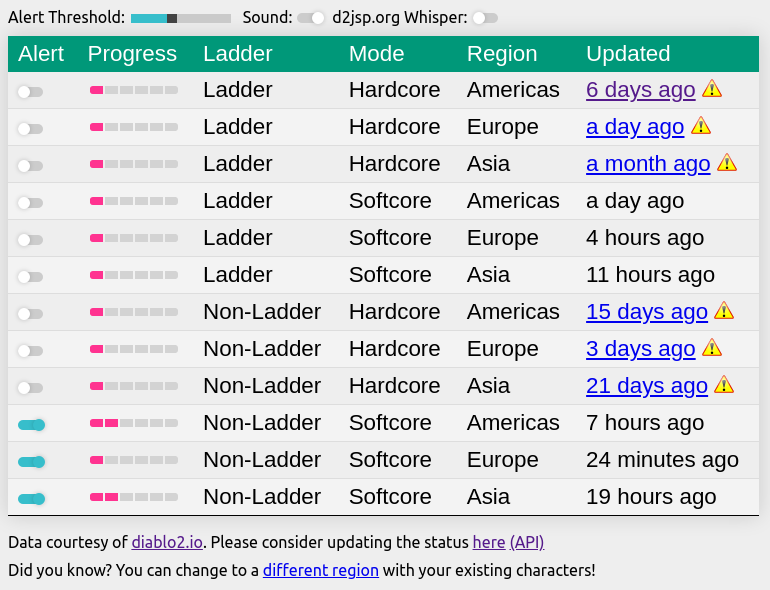
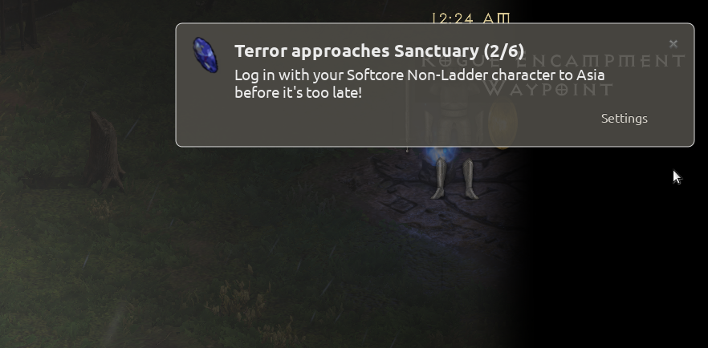

A Diablo Clone Tracker Chrome Extension
=======================================

Screenshots
-----------
Plugin Popup:

Notification:

Features
--------

- Overview of all regions and play-modes
- Subscribe to specific regions and play-modes
- Configuration of an alert threshold to only get notified if progress is at x/6
- Chrome notification while your browser is open
- Sound notification for alerts
- Warning of stale progress data with link to the progress reporter
- Listen to d2jsp.org and get notified if people are talking about "dclone"

DClone Progress Data
--------------------

The progress data is coming from
the [diablo2.io dclone tracker API](https://diablo2.io/forums/diablo-clone-uber-diablo-tracker-public-api-t906872.html)
and is updated by users.

This is a community project and requires community effort, so we encourage you to report and update a new dclone
progress [here](https://diablo2.io/dclonetracker.php). Let's keep the data accurate and up-to-date so you will never
miss a diablo clone event ever again!

Installation
------------

Download the .zip file.

Wishlist
--------

- Create Chrome extension options page
- Publish to the official Chrome extensions page
- Create tooltips when hovering over the progress bar
- Display the alert threshold with a concrete number
- Let user control if they want to be re-notified
- Let user decide how often to poll for updates
    - currently fixed to every 60s
- d2jsp.org
    - Let the user control what messages to look out for
    - Observe more than just the d2r software non-ladder topic

Contribute
----------
If you know HTML, CSS, a little JavaScript and have a Chrome browser you are good to go!
We don't have a process for contributing, so best to reach out via the `Discussion` Tab in GitHub.

